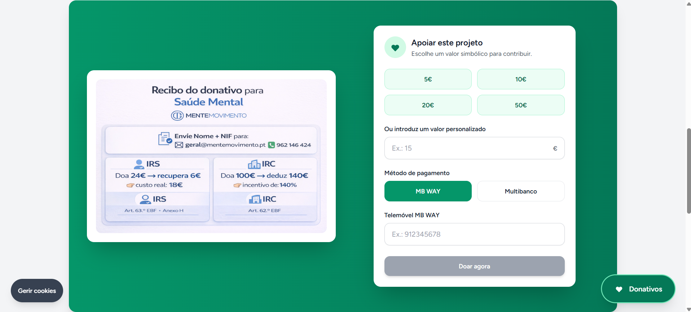
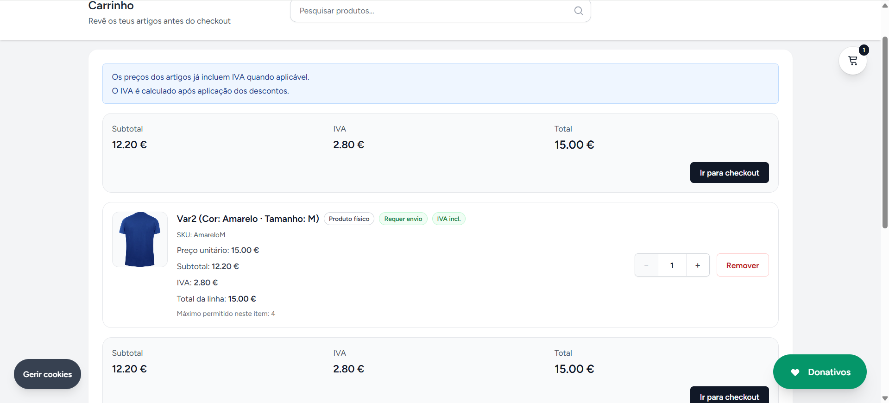
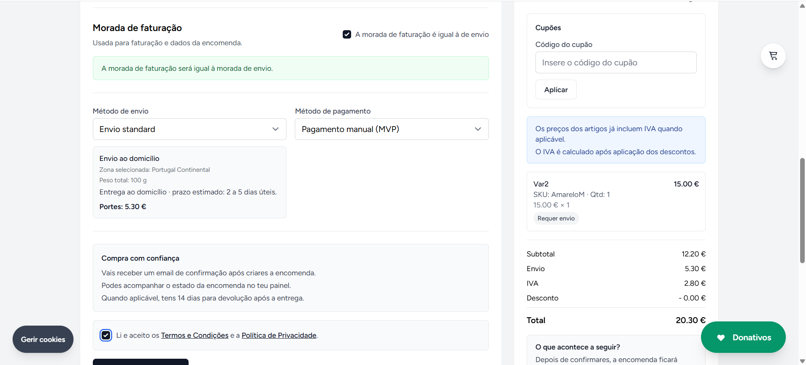
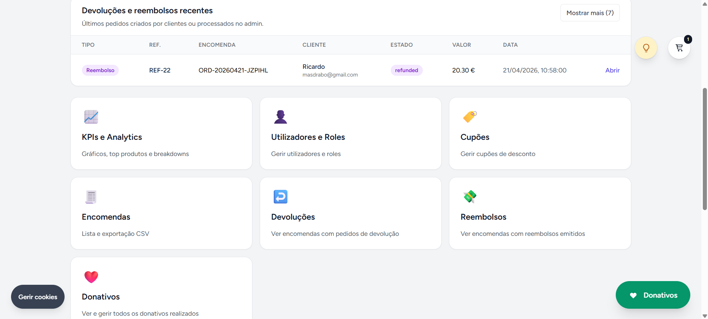
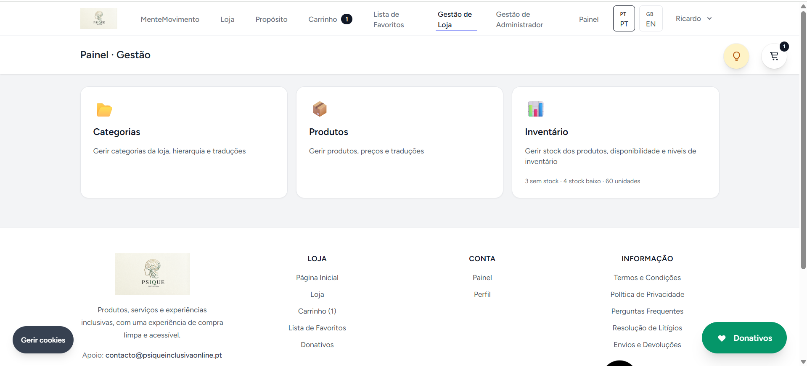
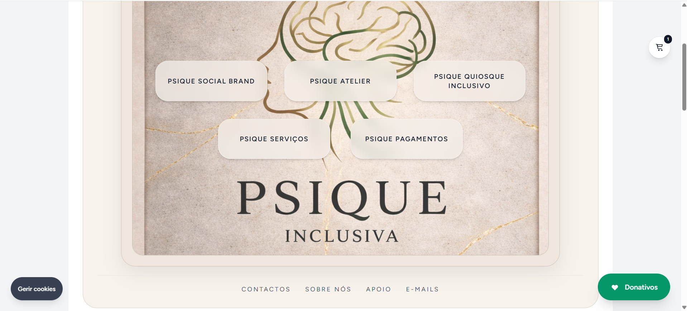
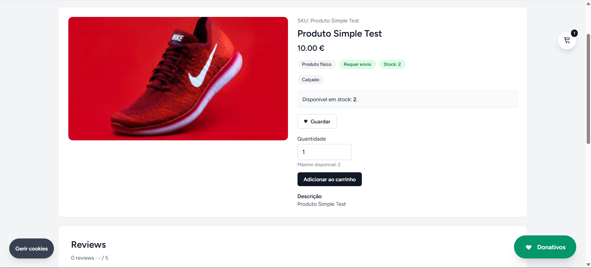

# 🧠 Psique Inclusiva - E-commerce Platform

Projeto desenvolvido no âmbito académico com o objetivo de criar uma plataforma completa de e-commerce para uma associação focada na saúde mental.

👉 https://psiqueinclusivaonline.pt/

---

## ✨ Sobre o Projeto

Esta plataforma permite a venda de produtos e a realização de donativos para apoiar causas ligadas à saúde mental, com uma experiência moderna, acessível e intuitiva.

Inclui uma área pública (loja e donativos) e uma área administrativa para gestão completa da plataforma.

---

## 🚀 Funcionalidades

- 🛒 Loja online completa
- 💳 Pagamentos com Multibanco e MBWay (Ifthenpay)
- 🎁 Sistema de donativos
- 👤 Autenticação de utilizadores
- 📦 Gestão de encomendas (admin e cliente)
- 🔁 Sistema de devoluções e reembolsos
- ❤️ Wishlist
- 🌍 Multi-idioma (PT / EN)
- 📊 Dashboard administrativo (KPIs e analytics)
- 🔍 Pesquisa de produtos
- 🧾 Histórico de encomendas

---

## 📸 Screenshots

### 💚 Donativos


### 🛒 Carrinho


### 💳 Checkout


### 🧑‍💼 Admin Dashboard


### 🛠 Manager Dashboard


### 🛍 Shop


### 👟 Produto


---

## 🧰 Tecnologias utilizadas

### Backend
- Laravel (PHP)
- MySQL

### Frontend
- React (Inertia.js)
- Tailwind CSS

### Pagamentos
- Ifthenpay (MBWay & Multibanco)

### Outras
- Vite
- REST APIs

---

## 🌐 Website

👉 https://psiqueinclusivaonline.pt/

---

## ⚙️ Como correr o projeto localmente

```bash
git clone https://github.com/Masdrabo/psique-inclusiva-ecommerce.git
cd psique-inclusiva-ecommerce

composer install
npm install

cp .env.example .env
php artisan key:generate

php artisan migrate --seed

npm run dev
php artisan serve
